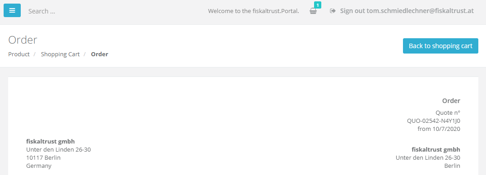
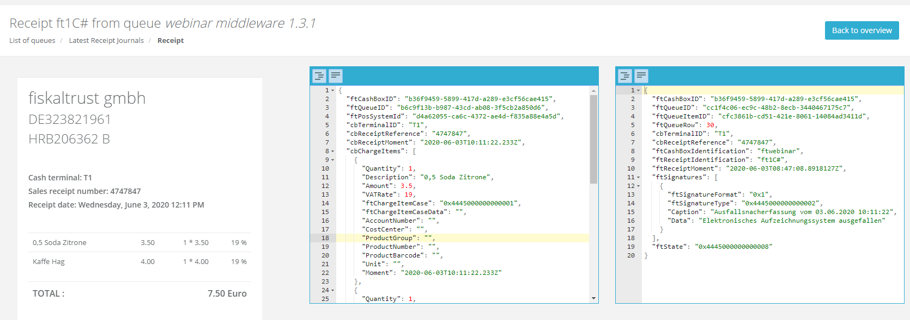
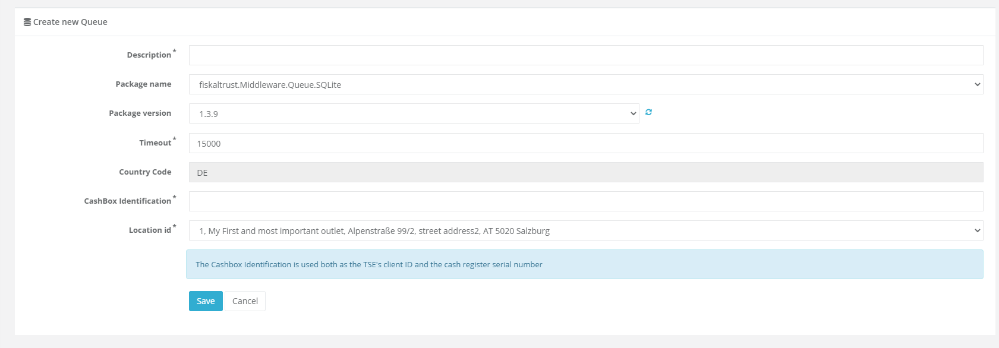

# fiskaltrust.Portal - Sprint 83
_September 28, 2020_

**Usability, shop & registration improvements**

In this sprint, we focused on improving commonly used features in the Portal. This includes the registration process, the UID validation, and several smaller fixes to improve the overall user experience. Additionally, we enabled the auto-invitation flow and the CSV bulk operator import in production.

## Features

### User Management

#### Activated POS Operator auto-invitation flow and outlet bulk import in production (DE)
After many successful tests in our sandbox systems, we're happy to announce that two highly requested features in the German portal were now enabled on our production systems:
- The automated POS Operator invitation, which allows to automatically connect operators by signing their partner contracts as a representative. Please make sure to carefully go through the contract before using this feature - a detailed description about this workflow can be found in the [release notes of sprint 76](portal-sprint-76.md#automatic-onboarding-of-posoperators-preview-germany-only).
- The bulk import functionality for outlets, which enables the creation of outlets directly from a CSV file. With this feature, we want to especially simplify the roll-out for very large customers. More details and a description of the steps can be found in the [release notes of sprint 79](portal-sprint-79.md#outlet-csv-import).

#### Registration improvements (All markets)
We recently received some requests for customers who were unable to register in our Portal, but not properly informed in the User Interface why this has happened or what the correct issue was. While our customer care team was able to resolve these issues manually, we understand that this is not a satisfying solution for this problem.

Hence, we went through the flow and improved it's stability on several ends. This includes better error handling, better visualizations of issues (the process is now guaranteed to stop in case of any errors, so users are not mislead), and general improvements to avoid some common errors in our logic.

These improvements also apply to related functionality, like the password reset feature.

### E-Commerce

#### UID validation (DE)
To resolve recurring questions from our customers, we changed the behavior of the UID (Ust-ID) validation and the respective warning in the shop. 

While there is still no governmental service available to properly validate the entered company data, we are able to validate if the company with the entered UID exists - and if yes, the validation is now treated as successful. 

_Before:_

_After:_

### Middleware Configuration

#### Display cases in requests and responses correctly (All markets)
Customers notified us that (due to JavaScript's limitations in handling large numbers), cases (_ftReceiptCase, ftChargeItemCase, ftPayItemCase, ..._) were not correctly displayed in the new receipt "raw" view, but contained only 000 after a specific position. This was now resolved by treating these elements as strings in our view (please note that internally, the data is stilled stored as a number).

#### Make Cashbox Identification less error-prone (DE)
As we use the _cashbox identification_ both as the cash register serial number (e.g. in DSFinV-K) and as the TSE's client ID, customers were sometimes running into issues when using a value that was not supported by some TSEs (e.g. a GUID). We hence limited the possible values for this field:
- It must contain between 2 and 30 characters
- It must only contain alphanumeric characters or dashes (`-`)

These limitations fulfill the shared requirements of all currently supported TSEs. Additionally, we added a small info box for further clarifying the usage of this value.

## Next steps
In the next sprints, we will continue to improve the usability and the user experience in the portal to make sure that it is easy to use. Additionally, we are focusing on improving the Middleware and adding more commonly requested products.

## Feedback
We would love to hear what you think about these features. To get in touch, please reach out to [info@fiskaltrust.at](mailto:info@fiskaltrust.at).
